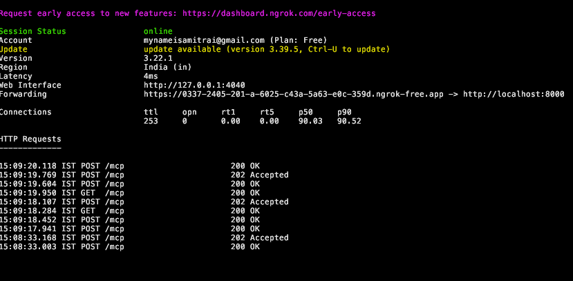
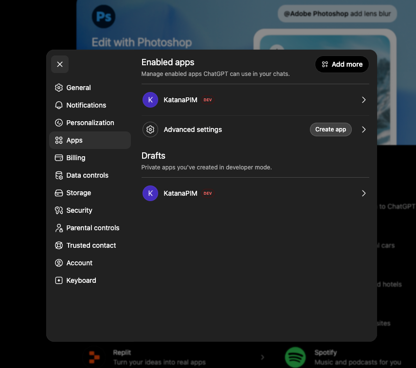
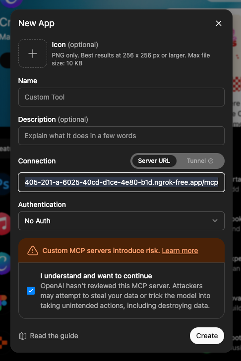
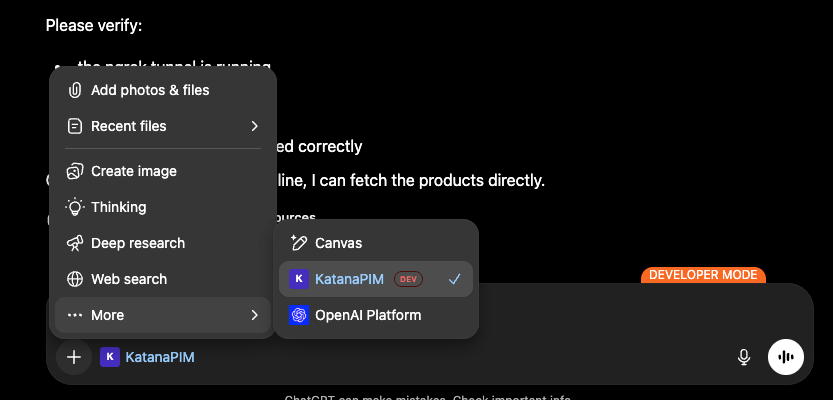

0. download build from https://github.com/amitkatana/katana-mcp/releases/tag/katana_mcp_1.0
1. get api key from https://demo.katanapim.com/User/Edit/78 or any user 

2. use api key to `./katana-mcp --api-key="api_key" --host="demo.katanapim.com"`

3.  applications runs on 8000 port 
4. use ngrok to expose application to web `ngrok http 8000`

5. open chat gpt app on your account

6. click on create apps

- Make sure to add /mcp at the end
- Click on customs mcp servers 
- Enter name 
- Click on create 

